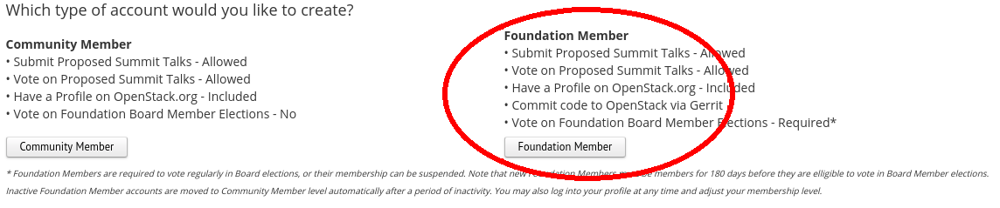

#############
Account Setup
#############

Setup Your OpenStack Foundation Account
=======================================

What is the OpenStack Foundation Account?
-----------------------------------------
Allows you to:

* Make code contributions.
* Vote in elections.
* Run for elected positions in the OpenStack project.
* Submit presentations to OpenStack conferences.

Sign Up
-------
.. note::

  Make sure to use the same email address you'll want to use for code
  contributions since it's important later that these match up.

#. Go to the `OpenStack Foundation sign up page
   <https://www.openstack.org/join>`_.
#. Under individual members, click the **Foundation Member** button.
#. Read through the presented individual member terms of service and our
   `Community Code of Conduct
   <https://www.openstack.org/legal/community-code-of-conduct/>`_.
#. Complete the application.

Setup Your Bug Tracker Account
==============================

.. note::
  The OpenStack community is currently in the process of moving from the bug
  tracking software Launchpad to StoryBoard. Further in the project specific
  on-boarding documentation, give special attention if the project is using
  Launchpad or StoryBoard.

StoryBoard
----------

What is StoryBoard?
^^^^^^^^^^^^^^^^^^^
`StoryBoard <https://storyboard.openstack.org>`_ is  bug tracking software the
OpenStack community is `developing
<https://wiki.openstack.org/wiki/StoryBoard>`_, and in the progress of
`migrating towards
<http://superuser.openstack.org/articles/openstack-gerrit-storyboard-integration/>`_.
Some `projects are already using it
<https://storyboard.openstack.org/#!/project/list>`_.

Sign Up
^^^^^^^
#. Go to the `storyboard.openstack.org <https://storyboard.openstack.org>`_.
#. On the top right corner, click the **login** button.
#. If you already have an Ubuntu One Account, you can just login.
#. If you don't have a Ubuntu One Account, click the **I am a new Ubuntu One
   user**.
#. Fill in your email address, name, password, and accepting the terms of
   services.

.. image:: _assets/account-setup/1.png

Launchpad
---------

What is Launchpad?
^^^^^^^^^^^^^^^^^^
`Launchpad <https://launchpad.net/openstack>`_ is the legacy way the OpenStack
community does bug tracking since we started `moving towards StoryBoard
<http://superuser.openstack.org/articles/openstack-gerrit-storyboard-integration>`_.

Sign Up
^^^^^^^
You're already signed up. Launchpad uses your Ubuntu One account for
authentication like StoryBoard.

Setup Your Gerrit Account
=========================

What is Gerrit?
---------------
This is the review system the OpenStack community uses. Here are just some of
the things we use Gerrit for reviewing:

* `Code <http://git.openstack.org/cgit>`_
* `Specifications <http://specs.openstack.org>`_
* `Translations <http://git.openstack.org/cgit/openstack/i18n/tree/>`_
* `Use cases for features
  <http://specs.openstack.org/openstack/openstack-user-stories/>`_

Sign Up
-------
#. Visit `OpenStack's Gerrit page <https://review.openstack.org>`_ and click
   the **sign in** link.
#. You will be prompted to select a username. You can enter the same one you
   did for launchpad, or something else.

.. note::

   Choose and type your username carefully.
   Once it is set, you cannot change the username.

.. note::

  From here on out when you sign into Gerrit, you'll be prompted to enter your
  your Launchpad login info. This is because Gerrit uses it as an OpenID single
  sign on.

Individual Contributor License Agreement
========================================

What is it?
-----------
An agreement to clarify intellectual property license granted with
contributions from a person or entity. `Preview the full agreement
<https://review.openstack.org/static/cla.html>`_.

Signing it
----------

Individual Contributors
^^^^^^^^^^^^^^^^^^^^^^^

#. In Gerrit's `settings <https://review.openstack.org/#/settings/agreements>`_
   click the **New Contributor Agreement** link and sign the agreement.

.. image:: _assets/account-setup/3.png

Contributors From a Company or Organization
^^^^^^^^^^^^^^^^^^^^^^^^^^^^^^^^^^^^^^^^^^^
If you are contributing on behalf of a company or organization.

#. In Gerrit's `settings <https://review.openstack.org/#/settings/agreements>`_
   click the **New Contributor Agreement** link and sign the agreement.

   .. image:: _assets/account-setup/3.png

#. An employer with the appropriate signing rights of the company or
   organization needs to sign the `Corporate Contributor License Agreement
   <https://secure.echosign.com/public/hostedForm?formid=56JUVGT95E78X5>`_.
#. If the CCLA only needs to be extended follow `this
   <https://wiki.openstack.org/wiki/HowToUpdateCorporateCLA>`_ procedure.

.. note::

  Employers can update the list of authorized employees by filling out and
  signing an `Updated Schedule
  A Form
  <https://openstack.echosign.com/public/hostedForm?formid=56JUVP6K4Z6P4C>`_.

Contributors From the U.S. Government
^^^^^^^^^^^^^^^^^^^^^^^^^^^^^^^^^^^^^
#. Someone of authority needs to sign the `U.S. Government Contributor License
   Agreement <https://wiki.openstack.org/wiki/GovernmentCLA>`_. Contact the
   `OpenStack Foundation <mailto:communitymngr@openstack.org>`_ to initiate
   this process.
